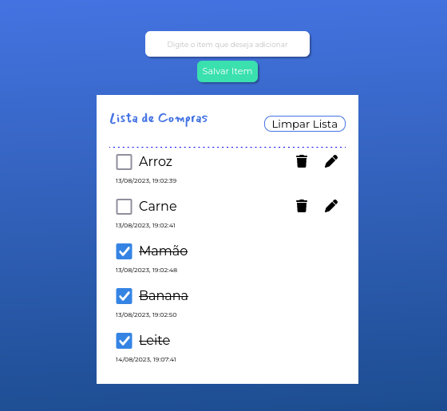

# Angular LifeCycle

This is **a simple shopping list application** developed with Angular. 
It allows the user to add, edit, remove and check items in a list.
It is also possible to delete all items at once by clicking a button.

  
  

    <small>
      A preview of the application.
    </small>
  

This project was developed while I was doing an Alura course about **Angular's Components LifeCycle**. On this course I learned about the use of some **lifecycle hooks**, such as *OnInit*, *OnChanges*, *DoCheck* and *OnDestroy*.

## Running a development server

Clone this repository and install its dependecies with `npm install`. Run `ng serve` for a development server and navigate to http://localhost:4200. The app will automatically reload if you change any of the source files.
